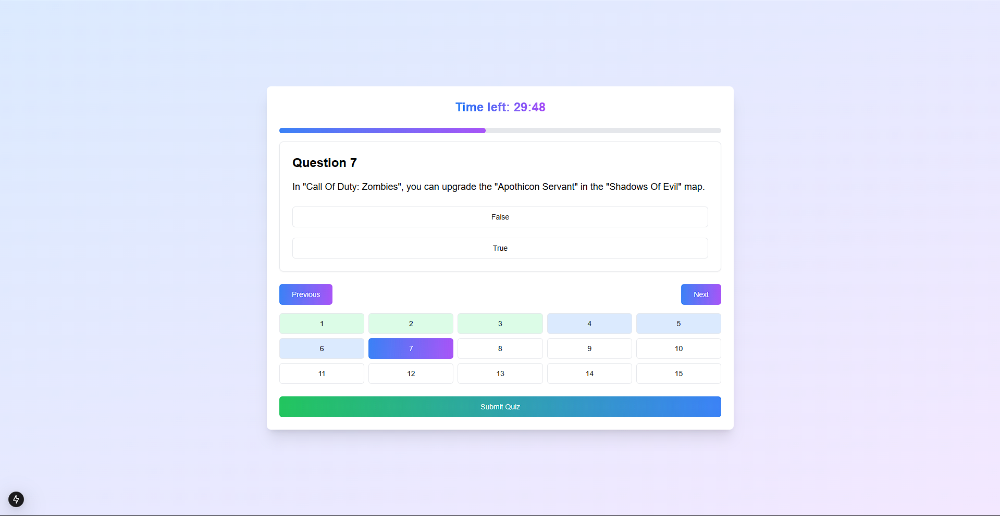

Here is the `README.md` file for your project:

````markdown
# Quiz App

A dynamic and interactive quiz application built using Next.js and React Query, designed to provide an engaging user experience for answering trivia questions. The app fetches questions from the [Open Trivia Database](https://opentdb.com/) and includes features like timed quizzes, progress tracking, and detailed reports.

## 🚀 Live Demo

[Quiz App Live](https://quiz-app-casualfunnel.netlify.app/)

## 📂 Repository

[GitHub Repository](https://github.com/hari-bot/quiz-app-next)

## 📸 Screenshot



---

## 🛠️ Features

- **Dynamic Question Fetching**: Questions are fetched from an external API for fresh content every session.
- **Timer**: A countdown timer ensures the quiz is completed within 30 minutes.
- **Progress Tracking**: Users can navigate through questions and track their progress.
- **Detailed Report**: At the end of the quiz, users get a detailed report of their performance, including correct answers and explanations.

---

## 📦 Installation and Setup

Follow these steps to run the project locally:

### Clone the Repository

```bash
git clone https://github.com/hari-bot/quiz-app-next.git
cd quiz-app-next
```
````

### Install Dependencies

```bash
npm install
# or
yarn install
# or
pnpm install
```

### Start the Development Server

```bash
npm run dev
# or
yarn dev
# or
pnpm dev
```

Open [http://localhost:3000](http://localhost:3000) in your browser to see the app in action.

---

## 🤔 Assumptions

1. Users are expected to have a stable internet connection to fetch quiz questions from the API.
2. The app assumes all questions fetched from the API are valid and properly formatted.
3. Quiz session is completed in one sitting
4. Users will provide a valid email address
5. 30 minutes is sufficient time for 15 questions

---

## 🚧 Challenges Faced

### API Rate Limits

- **Challenge**: The Open Trivia Database API has a rate limit, which could affect frequent use during testing.
- **Solution**: Implemented caching using React Query's stale time to minimize API calls.

### Timer Management

- **Challenge**: Ensuring the timer works across different questions without disrupting the quiz flow.
- **Solution**: Used `setInterval` with proper cleanup to manage the timer effectively.

### Navigation and Progress Tracking

- **Challenge**: Users needed an intuitive way to navigate questions while tracking attempted and unattempted ones.
- **Solution**: Built a `QuestionNavigation` component that visually represents progress.

**Question Consistency**

- **Challenge**: Questions in the report page didn't match the questions from the quiz
- **Solution**: Implemented proper caching strategy using React Query's `staleTime` and moved questions fetching to the parent component

**Navigation State**

- **Challenge**: Maintaining accurate state for visited and answered questions
- **Solution**: Created a robust state management system using arrays to track question status

---

## 🙌 Contributions

Contributions are welcome! Feel free to fork the repository and submit a pull request.

---

## ✨ Author

[Hari Bot](https://github.com/hari-bot)

```

```
